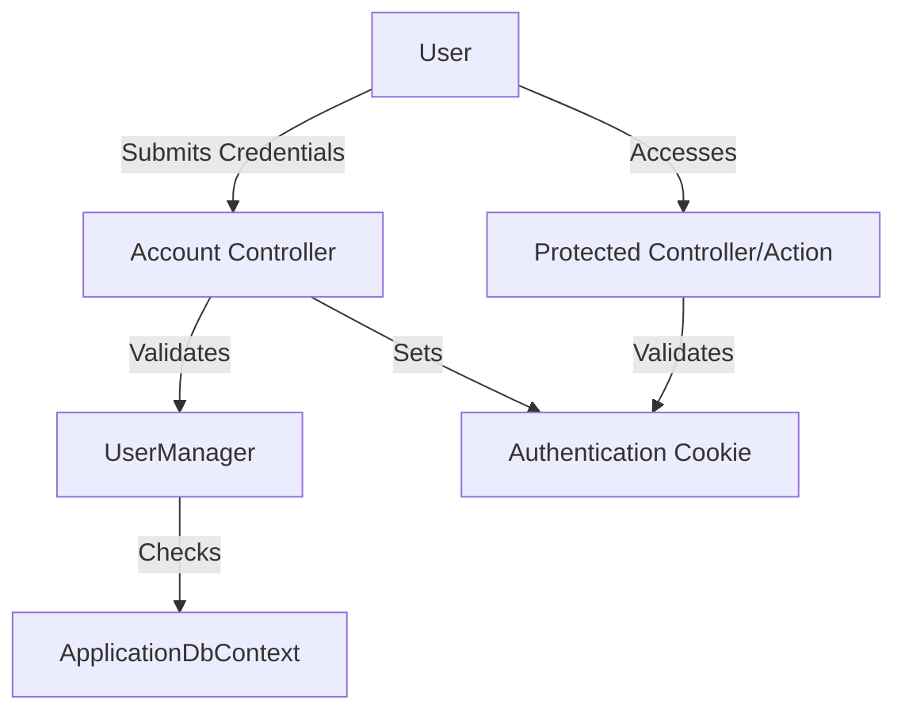

# AuthenticationInAspnetCore

AuthenticationInAspnetCore is a sample ASP.NET Core project demonstrating the implementation of authentication mechanisms. The project showcases how to set up authentication, manage user login, registration, and secure access to protected resources. It provides a clear structure for handling user credentials and session management within an ASP.NET Core application.

---

## Table of Contents

- [Project Overview](#project-overview)
- [Architecture](#architecture)
- [Setup and Installation](#setup-and-installation)
- [Configuration](#configuration)
- [Authentication Workflow](#authentication-workflow)
- [Controllers](#controllers)
- [Models](#models)
- [Data Access](#data-access)
- [Authorization Policies](#authorization-policies)
- [Error Handling](#error-handling)
- [Running the Application](#running-the-application)
- [Project Structure](#project-structure)
- [Dependencies](#dependencies)

---

## Project Overview

This repository demonstrates authentication in an ASP.NET Core application using standard features like Identity, Cookie authentication, and secure user management. The application allows users to register, log in, and access protected resources. It serves as a template for building secure ASP.NET Core web applications.

---

## Architecture

The project follows a modular architecture, separating concerns into controllers, models, views, and data contexts. Authentication logic is centralized and leverages ASP.NET Core’s built-in middleware for identity management.



---

## Setup and Installation

Follow these steps to set up the application:

1. Clone the repository:
    ```bash
    git clone https://github.com/Sehar-1207/AuthenticationInAspnetCore.git
    ```
2. Navigate to the project directory:
    ```bash
    cd AuthenticationInAspnetCore
    ```
3. Restore dependencies:
    ```bash
    dotnet restore
    ```
4. Update the database (if migrations are present):
    ```bash
    dotnet ef database update
    ```
5. Run the application:
    ```bash
    dotnet run
    ```

---

## Configuration

- The project uses `appsettings.json` for configuration, including database connection strings and authentication settings.
- Identity options and authentication schemes are configured in `Startup.cs` via `ConfigureServices` and `Configure`.

---

## Authentication Workflow

1. **Registration:** Users register with a username, email, and password.
2. **Login:** Users log in with credentials. The system validates and sets an authentication cookie.
3. **Protected Resources:** Only authenticated users can access controllers/actions decorated with the `[Authorize]` attribute.
4. **Logout:** Users can log out, clearing the authentication session.

---

## Controllers and Endpoints

### AccountController

Handles user registration, login, and logout actions.


```api
{
    "title": "User Logout",
    "description": "Logs out the authenticated user and clears the session.",
    "method": "POST",
    "baseUrl": "https://localhost:5001",
    "endpoint": "/Account/Logout",
    "headers": [],
    "queryParams": [],
    "pathParams": [],
    "bodyType": "none",
    "requestBody": "",
    "responses": {
        "200": {
            "description": "Logout successful",
            "body": "{\n  \"message\": \"User logged out.\"\n}"
        }
    }
}
```

---

## Models

- **ApplicationUser**: Represents application users, extends IdentityUser.
- **RegisterViewModel**: Holds registration data fields.
- **LoginViewModel**: Contains login credentials.

---

## Data Access

- The project uses Entity Framework Core for data access.
- `ApplicationDbContext` manages user, role, and authentication data.
- Migrations are used for evolving the schema.

---

## Authorization Policies

- Controllers and actions use `[Authorize]` to restrict access to authenticated users.
- `[AllowAnonymous]` is applied to actions permitting public access (e.g., registration, login).

---

## Error Handling

- The application displays validation messages for failed logins or registrations.
- Model state validation ensures only valid data is processed.
- Errors are returned in standardized formats for API endpoints.

---

## Running the Application

1. Build and run using `dotnet run`.
2. Access the application in your browser at `https://localhost:5001`.
3. Register a new user, log in, and navigate to protected areas.

---

## Project Structure

- `Controllers/`: Contains controller classes for handling requests.
- `Models/`: ViewModels and entity models for user data.
- `Data/`: Database context and migration files.
- `Views/`: Razor views for UI rendering.
- `wwwroot/`: Static files and assets.
- `Startup.cs`: Application configuration, middleware, and services setup.

---

## Dependencies

- ASP.NET Core
- Entity Framework Core
- Microsoft.AspNetCore.Identity
- Microsoft.AspNetCore.Authentication.Cookies

---


```card
{
    "title": "Authentication Sample Project",
    "content": "This repository provides a working example of authentication in ASP.NET Core using Identity and Cookie authentication."
}
```
